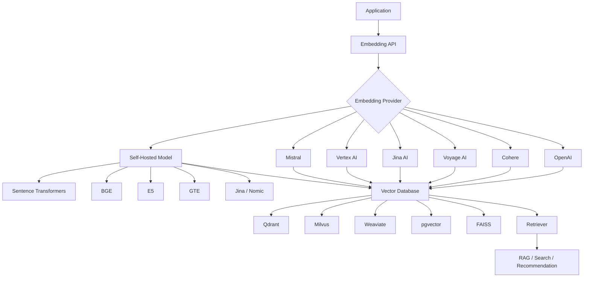
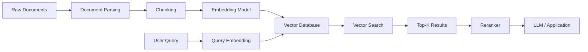

<p align="center">
  
</p>

# 🧠 Awesome Embedding Model API 🚀

<p align="center">
  <a href="https://github.com/ishandutta2007/Awesome-Awesome-Awesome"></a>
  <a href="https://discord.gg/jc4xtF58Ve"></a>
  <a href="https://github.com/ishandutta2007/Awesome-Embedding-Model-API/stargazers"></a>
  <a href="https://github.com/ishandutta2007/Awesome-Embedding-Model-API/network/members"></a>
  <a href="https://github.com/ishandutta2007/Awesome-Embedding-Model-API/issues"></a>
  <a href="https://github.com/ishandutta2007/Awesome-Embedding-Model-API/blob/main/LICENSE"></a>
  <a href="https://github.com/ishandutta2007"></a>
</p>

A curated directory of **Embedding Model APIs**, commercial hosted platforms, text & multimodal embedding services, open-source embedding models, inference engines, vector retrieval pipelines, and vector databases. Essential for **RAG**, **semantic search**, **knowledge bases**, and **AI agents**.

> 💡 **Open-source software is the primary focus of this repository.** This guide indexes commercial embedding SaaS APIs alongside the thriving open-source embedding ecosystem that can be self-hosted, fine-tuned, and deployed on private infrastructure without vendor lock-in.

---

Embedding models convert text, code, images, or other data into numerical vectors that capture semantic relationships. These vectors power applications such as:


* 🔎 Semantic Search

* 📚 Retrieval-Augmented Generation (RAG)

* 🧠 Knowledge Bases

* 🗂️ Document Clustering

* 🏷️ Classification

* 🔗 Recommendation Systems

* 💬 Semantic Similarity

* 🧑‍💻 Code Search

* 🖼️ Multimodal Search

* 🔍 Duplicate Detection

* 🤖 AI Agents

* 🏢 Enterprise Search


---


## 📑 Table of Contents


* [☁️ SaaS/Hosted Platforms](#️-saashosted-platforms)

* [🌍 Open-Source](#-open-source)

* [🧠 Open-Source Embedding Model Families](#-open-source-embedding-model-families)

* [⚡ Open-Source Embedding Inference & Serving](#-open-source-embedding-inference--serving)

* [🔬 Open-Source Embedding Frameworks](#-open-source-embedding-frameworks)

* [🌎 Multilingual Embedding Models](#-multilingual-embedding-models)

* [💻 Code Embedding Models](#-code-embedding-models)

* [🖼️ Multimodal Embedding Models](#️-multimodal-embedding-models)

* [🗄️ Open-Source Vector Databases](#️-open-source-vector-databases)

* [🏗️ Embedding Architecture](#️-embedding-architecture)

* [🔍 Commercial vs Open-Source](#-commercial-vs-open-source)

* [⭐ Recommended Open-Source Stacks](#-recommended-open-source-stacks)

* [🚧 Where Open Source Still Has Gaps](#-where-open-source-still-has-gaps)

* [🤝 How to Contribute](#-how-to-contribute)

* [⚠️ Disclaimer](#️-disclaimer)

* [⭐ Star History](#-star-history)


---


# ☁️ SaaS/Hosted Platforms

Commercial and hosted APIs providing managed embedding models for semantic search, RAG, recommendations, classification, clustering, code search, and multimodal retrieval.

> 📊 **Market Overview & Structure**: The global AI embedding and vector search market is currently estimated at **$2.8 Billion - $3.5 Billion (2025–2026)** and projected to surge beyond **$16 Billion by 2032** (~25.4% CAGR). The sector is **moderately fragmented** rather than winner-take-all: while cloud hyperscalers (Microsoft Azure, AWS, Google Cloud) command massive enterprise volume, specialized retrieval engines (Cohere, Voyage AI, Jina AI) and agile serverless providers (Together AI, Fireworks, DeepInfra) capture significant market share with superior domain latency, multimodal capabilities, and aggressive pricing.

| Platform | Market Cap / Valuation / Revenue | Description | Primary Focus | Pricing | Free Tier Limit |
| --- | --- | --- | --- | --- | --- |
| [Azure OpenAI Embeddings](https://azure.microsoft.com/en-us/products/ai-services/openai-service) | ~$3.1T Market Cap / ~$245B Rev | Azure-hosted OpenAI embedding models integrated with enterprise security and compliance. | Enterprise Cloud | $0.02 / 1M tokens (text-embedding-3-small); $0.13 / 1M tokens (text-embedding-3-large) | Free trial: 30 days with $200 in Azure credits via Azure Free Account |
| [NVIDIA NIM](https://www.nvidia.com/en-us/ai-data-science/products/nim-microservices/) | ~$2.8T Market Cap / ~$120B Rev | Containerized inference microservices for deploying optimized AI embedding models on GPUs. | GPU Inference | $1.00 / GPU-hour on cloud instances (or $4,500/year per GPU license; partner serverless from $0.05 / 1M tokens) | Free trial: 90 days with 1,000 free API credits on sign-up (up to 5,000 credits for evaluation) |
| [Google Vertex AI Embeddings](https://cloud.google.com/vertex-ai/generative-ai/docs/embeddings/get-text-embeddings) | ~$2.1T Market Cap / ~$350B Rev | Managed Google Cloud embedding models for semantic search, classification, clustering, and retrieval. | Cloud AI | $0.025 / 1M characters (~$0.10 / 1M tokens for text-embedding-005); $0.15 / 1M tokens (gemini-embedding-001) | Free trial: 90 days with $300 in Google Cloud credits; free tier via Google AI Studio up to 1,500 RPM |
| [Amazon Titan Text Embeddings](https://aws.amazon.com/bedrock/amazon-models/) | ~$1.9T Market Cap / ~$600B Rev | Amazon Bedrock embedding models for semantic search, RAG, and vector retrieval applications. | AWS / Enterprise | $0.02 / 1M tokens (Titan Text Embeddings V2); $0.10 / 1M tokens (Titan V1) | Free trial: 180 days with up to $200 in AWS promotional credits ($100 at signup + $100 for onboarding) |
| [IBM watsonx Embeddings](https://www.ibm.com/watsonx) | ~$200B Market Cap / ~$62B Rev | Enterprise AI platform providing embedding capabilities as part of the watsonx ecosystem. | Enterprise AI | $0.10 / 1M tokens ($0.0001 per 1,000 tokens) | Free forever (Sandbox/Lite plan): 300,000 foundation model tokens/month and 20 Compute Usage Hours/month |
| [OpenAI Embeddings](https://platform.openai.com/docs/guides/embeddings) | ~$157B Valuation / ~$3.7B+ Rev | Managed embedding APIs for generating vector representations for search, clustering, and recommendations. | General Embeddings | $0.02 / 1M tokens (text-embedding-3-small); $0.13 / 1M tokens (text-embedding-3-large) | Free trial: 90 days with $5 in API credits (rate limits: 3 RPM / 200 RPD / 40,000 TPM) |
| [Cloudflare Workers AI](https://developers.cloudflare.com/workers-ai/) | ~$35B Market Cap / ~$1.6B Rev | Edge AI platform providing hosted model inference close to applications and users. | Edge AI | $0.011 / 1,000 Neurons (~$0.013 to $0.020 / 1M tokens for bge-base-en-v1.5) | Free forever: 10,000 Neurons/day (~7.7M tokens/day or ~50,000 embedding requests/day) |
| [Mistral Embeddings](https://docs.mistral.ai/capabilities/embeddings/) | ~$6.2B Valuation | Embedding API supporting text and code embeddings for retrieval, classification, and semantic search. | Text / Code | $0.10 / 1M tokens (mistral-embed) | Free forever (Experiment plan): Rate limit of 1 RPS / 30 RPM and up to 500,000 tokens/month for prototyping |
| [Cohere Embed](https://cohere.com/embed) | ~$5.5B Valuation / ~$50M+ Rev | Enterprise embedding API supporting text and multimodal inputs designed for search, classification, and clustering. | Enterprise Search / Multimodal | $0.10 / 1M tokens (Embed v3); $0.12 / 1M tokens (Embed v4); $0.47 / 1M image tokens | Free forever (Trial Key): 1,000 API calls/month (rate limit: 5 calls/min) for non-production evaluation |
| [Hugging Face Inference Providers](https://huggingface.co/inference) | ~$4.5B Valuation / ~$70M+ Rev | Hosted access to open models from the Hugging Face ecosystem through inference APIs. | Open Models | $0.02 / 1M tokens via Inference Providers (PRO plan at $9/month; dedicated GPU endpoints from $0.50/hour) | Free forever (Serverless API): ~1,000 requests/day for models under 10GB, plus monthly developer credits |
| [Together AI](https://www.together.ai/) | ~$1.25B Valuation (Unicorn) | Hosted inference platform supporting an open model ecosystem and high-throughput embedding workloads. | Open Models | $0.02 / 1M tokens (bge-base-en-v1.5); $0.08 / 1M tokens (bge-large-en-v1.5) | Free trial: 90 days with $5.00 to $25.00 in API credits for new accounts |
| [Fireworks AI](https://fireworks.ai/) | ~$552M Valuation | Production AI inference platform supporting open models and low-latency embedding APIs. | Inference | $0.008 / 1M tokens (models ≤150M params); $0.016 / 1M tokens (models 150M–350M params) | Free forever: $1.00 free API credit on signup (equivalent to ~62.5M to 125M embedding tokens), no expiry |
| [Replicate](https://replicate.com/) | ~$350M Valuation | Hosted API platform for running machine-learning models, including embedding and retrieval models. | Model APIs | $0.000100 / CPU-sec and $0.000225 / T4 GPU-sec (~$0.02 / 1M tokens on official embedding models) | Free trial: 30 days with ~$5 in promotional trial credits or limited free model test runs on signup |
| [Voyage AI](https://www.voyageai.com/) | ~$250M Valuation | Specialized retrieval embedding platform offering general, multilingual, code, finance, and domain-specific models. | Retrieval / Domain Embeddings | $0.02 / 1M tokens (voyage-3-lite / voyage-4-lite); $0.12 / 1M tokens (voyage-3 / voyage-4) | Free forever: 200M free tokens on sign-up for general models (50M tokens for domain models), no expiration date |
| [Jina AI](https://jina.ai/embeddings/) | ~$100M+ Valuation | Embedding APIs focused on 8k long-context, multilingual, and multimodal retrieval workloads. | Search / RAG | $0.05 / 1M tokens (via $50 bundle for 1B tokens; $500 bundle for 11B tokens at $0.045 / 1M tokens) | Free forever: 10M free tokens on sign-up (rate limit: 100 RPM / 100,000 TPM) for non-commercial use |
| [Nomic Embed](https://www.nomic.ai/) | ~$100M Valuation | Embedding ecosystem providing high-quality open-weight embeddings and hosted embedding capabilities. | Open Models / Retrieval | $20/month (Individual plan includes $20/month AI credits; additional usage at $0.10 / 1M tokens) | Free trial: 30 days with $20 in AI usage credits on sign-up (or 1M free tokens for API testing) |
| [DeepInfra](https://deepinfra.com/) | ~$15M Valuation (Seed) | Serverless AI inference platform offering low-cost managed open-source embedding models. | Open Models / Serverless | $0.005 / 1M tokens (bge-base-en-v1.5, e5-base-v2); $0.01 / 1M tokens (bge-large-en-v1.5, bge-m3) | Free trial: 30 days with $30 in credits upon signup, plus unauthenticated testing allowance |
| [Infinity Embeddings](https://github.com/michaelfeil/infinity) | Open-Source ($0 corp) | High-performance embedding inference platform that exposes embedding and reranking models through APIs. | Self-Hosted / API | $0 (Free open-source MIT; self-host on cloud compute instances from ~$5.00/month) | Free forever: 100% open-source MIT license with unlimited self-hosted requests and tokens |

> Cohere's current Embed API supports text and image inputs, and its API distinguishes use cases such as `search_document`, `search_query`, classification and clustering.


> Voyage provides hosted embedding models for general, multilingual and specialized retrieval workloads, with configurable embedding dimensions on supported models.


> Mistral provides both general text embeddings and code embeddings, covering use cases such as RAG, semantic code search, clustering and classification.


---


# 🌍 Open-Source

Open-source embedding models, frameworks, inference serving engines, and vector databases that can be self-hosted and integrated into applications without vendor lock-in.

> 💻 Open-source embedding software can be run locally on GPUs, CPUs, Apple Silicon, private clouds, or Kubernetes clusters with zero per-token cost.

| Project | Description | Primary Strength |
| --- | --- | --- |
| [Ollama](https://github.com/ollama/ollama) [](https://github.com/ollama/ollama/stargazers) | Lightweight local runtime for pulling, serving, and embedding with open models (nomic-embed, bge, mxbai). | Local AI & Embedding Inference |
| [LangChain](https://github.com/langchain-ai/langchain) [](https://github.com/langchain-ai/langchain/stargazers) | Comprehensive application framework with integrations for 50+ embedding providers and vector stores. | RAG Orchestration & Agents |
| [llama.cpp](https://github.com/ggml-org/llama.cpp) [](https://github.com/ggml-org/llama.cpp/stargazers) | Ultra-fast C/C++ inference engine supporting quantised embedding models on CPU and Apple Silicon / CUDA. | Edge / CPU Embedding Serving |
| [vLLM](https://github.com/vllm-project/vllm) [](https://github.com/vllm-project/vllm/stargazers) | High-throughput serving engine with PagedAttention and native pooling model support for dense embeddings. | Production AI Serving |
| [RAGFlow](https://github.com/infiniflow/ragflow) [](https://github.com/infiniflow/ragflow/stargazers) | Open-source RAG engine based on deep document understanding and multi-modal embedding pipelines. | Enterprise RAG Systems |
| [LlamaIndex](https://github.com/run-llama/llama_index) [](https://github.com/run-llama/llama_index/stargazers) | Data framework tailored to indexing, chunking, and querying custom embedding models for LLMs. | Data Ingestion & Retrieval |
| [Milvus](https://github.com/milvus-io/milvus) [](https://github.com/milvus-io/milvus/stargazers) | Distributed cloud-native vector database designed to manage and search massive billion-scale vector indexes. | Large-Scale Vector Database |
| [FAISS](https://github.com/facebookresearch/faiss) [](https://github.com/facebookresearch/faiss/stargazers) | Fundamental C++ and Python library by Meta for fast nearest-neighbor similarity search in high-dimensional spaces. | Vector Indexing & Search |
| [Qdrant](https://github.com/qdrant/qdrant) [](https://github.com/qdrant/qdrant/stargazers) | Vector similarity search engine written in Rust with advanced payload-based filtering and hybrid search. | Production Vector Database |
| [CLIP](https://github.com/openai/CLIP) [](https://github.com/openai/CLIP/stargazers) | Pioneering multimodal embedding model projecting text and images into a shared semantic vector space. | Multimodal Retrieval |
| [Chroma](https://github.com/chroma-core/chroma) [](https://github.com/chroma-core/chroma/stargazers) | Developer-friendly open-source vector store designed for developer ergonomics in Python and TypeScript. | Prototyping & RAG |
| [Haystack](https://github.com/deepset-ai/haystack) [](https://github.com/deepset-ai/haystack/stargazers) | Production-ready orchestration framework for compound AI, neural semantic search, and RAG pipelines. | Enterprise Search & Retrieval |
| [pgvector](https://github.com/pgvector/pgvector) [](https://github.com/pgvector/pgvector/stargazers) | Lightweight PostgreSQL extension bringing vector similarity search (HNSW, IVFFlat) to relational DBs. | Relational + Vector Storage |
| [E5 / UniLM](https://github.com/microsoft/unilm) [](https://github.com/microsoft/unilm/stargazers) | Microsoft's prominent family of universal text embeddings covering general, multilingual, and Mistral variants. | General & Multilingual Search |
| [Sentence Transformers](https://github.com/UKPLab/sentence-transformers) [](https://github.com/UKPLab/sentence-transformers/stargazers) | The industry-standard Python framework for training, fine-tuning, and inferencing state-of-the-art embeddings. | Embedding Training & Inference |
| [Weaviate](https://github.com/weaviate/weaviate) [](https://github.com/weaviate/weaviate/stargazers) | Open-source vector database with modular vectorizer plugins, GraphQL API, and BM25 hybrid ranking. | Cloud & Hybrid Vector Search |
| [txtai](https://github.com/neuml/txtai) [](https://github.com/neuml/txtai/stargazers) | All-in-one semantic search, embedding database, and workflow engine combining vector search with graphs. | Semantic Search Workflows |
| [FlagEmbedding / BGE](https://github.com/FlagOpen/FlagEmbedding) [](https://github.com/FlagOpen/FlagEmbedding/stargazers) | State-of-the-art BGE embedding models, multi-vector BGE-M3, visual embeddings, and cross-encoder rerankers. | Dense, Sparse & Multi-Vector RAG |
| [ImageBind](https://github.com/facebookresearch/ImageBind) [](https://github.com/facebookresearch/ImageBind/stargazers) | Unified joint embedding architecture linking images, text, audio, depth, thermal, and IMU data. | Multi-Modal Representation |
| [Text Embeddings Inference](https://github.com/huggingface/text-embeddings-inference) [](https://github.com/huggingface/text-embeddings-inference/stargazers) | Ultra-fast Rust/gRPC/HTTP inference engine with flash attention, token streaming, and dynamic batching. | Production Inference API |
| [ColBERT](https://github.com/stanford-futuredata/ColBERT) [](https://github.com/stanford-futuredata/ColBERT/stargazers) | Efficient late-interaction neural retrieval model computing fine-grained token-level contextual similarity. | High-Precision Neural Search |
| [SimCSE](https://github.com/princeton-nlp/SimCSE) [](https://github.com/princeton-nlp/SimCSE/stargazers) | Contrastive learning framework establishing sentence representations with dropout-based augmentation. | Unsupervised Sentence Similarity |
| [MTEB Benchmark](https://github.com/embeddings-benchmark/mteb) [](https://github.com/embeddings-benchmark/mteb/stargazers) | The definitive benchmark framework for evaluating text and multimodal embedding models across 100+ tasks. | Embedding Evaluation & Ranking |
| [Infinity](https://github.com/michaelfeil/infinity) [](https://github.com/michaelfeil/infinity/stargazers) | Blazing fast inference server for Sentence Transformers, rerankers, and CLIP with OpenAI-compatible API. | Self-Hosted Inference Server |
| [Nomic](https://github.com/nomic-ai/nomic) [](https://github.com/nomic-ai/nomic/stargazers) | Client and open-weight models including nomic-embed-text offering long context window (8192 tokens). | Long-Context Embeddings |
| [GritLM](https://github.com/ContextualAI/gritlm) [](https://github.com/ContextualAI/gritlm/stargazers) | Generative Representational Instruction Tuning unifying embedding representations and text generation. | Dual Embedding & Generation |

Sentence Transformers supports computing embeddings, training and fine-tuning embedding models, sparse encoders, rerankers and multi-vector encoders; its ecosystem includes thousands of pretrained models.


FlagEmbedding provides a broader retrieval toolkit covering embedding inference, reranking, fine-tuning and evaluation, including the BGE family.


---


# 🧠 Open-Source Embedding Model Families


## BGE


**BGE — BAAI General Embedding**


```text

BGE

├── BGE-Base

├── BGE-Large

├── BGE-M3

├── BGE-ICL

├── BGE-VL

└── BGE Rerankers

```


Best suited for:


* Semantic search

* RAG

* Multilingual retrieval

* Dense retrieval

* Sparse retrieval

* Multi-vector retrieval

* Multimodal search


BGE-M3 is particularly interesting because it supports dense retrieval, lexical matching and multi-vector interaction.


---


## E5


```text

E5

├── E5-base

├── E5-large

├── multilingual-e5

└── E5-Mistral

```


Best suited for:


* Semantic search

* Cross-lingual retrieval

* RAG

* Sentence similarity


---


## GTE


```text

GTE

├── GTE-base

├── GTE-large

├── GTE-modernbert

└── multilingual GTE

```


Best suited for:


* General semantic retrieval

* Multilingual applications

* RAG

* Search


---


## Nomic Embed


```text

Nomic Embed

├── nomic-embed-text

└── newer Nomic embedding models

```


Best suited for:


* Long-context retrieval

* Semantic search

* RAG

* Local inference


---


## Jina Embeddings


```text

Jina Embeddings

├── Jina Embeddings v2

├── Jina Embeddings v3

├── Jina Embeddings v4

└── Multilingual / Multimodal Models

```


Best suited for:


* Long documents

* Multilingual search

* RAG

* Multimodal retrieval


---


# ⚡ Open-Source Embedding Inference & Serving


These projects turn open embedding models into production APIs.


| Project                                                                                            | Description                                                                                                              | Best Use              |

| -------------------------------------------------------------------------------------------------- | ------------------------------------------------------------------------------------------------------------------------ | --------------------- |

| [Infinity](https://github.com/michaelfeil/infinity)                                                | High-performance inference server for embedding and reranking models with API-compatible serving.                        | Production Embeddings |

| [Hugging Face Text Embeddings Inference](https://github.com/huggingface/text-embeddings-inference) | Specialized inference server for text embedding models.                                                                  | Embedding API         |

| [vLLM](https://github.com/vllm-project/vllm)                                                       | High-performance inference engine that supports modern embedding and pooling workloads in addition to generative models. | High-Throughput AI    |

| [Sentence Transformers](https://github.com/UKPLab/sentence-transformers)                           | Python framework for directly generating embeddings from pretrained models.                                              | Development / Serving |

| [FlagEmbedding](https://github.com/FlagOpen/FlagEmbedding)                                         | Toolkit for embedding and reranker inference, training and evaluation.                                                   | Retrieval Models      |

| [TEI](https://github.com/huggingface/text-embeddings-inference)                                    | Hugging Face's optimized server for text embeddings and related models.                                                  | Production Serving    |

| [Ollama](https://github.com/ollama/ollama)                                                         | Local model runtime that can be used with supported embedding models.                                                    | Local AI              |

| [llama.cpp](https://github.com/ggml-org/llama.cpp)                                                 | Lightweight inference ecosystem that can support embedding workloads for compatible models.                              | CPU / Edge            |

| [NVIDIA Triton](https://github.com/triton-inference-server/server)                                 | General-purpose production inference server suitable for embedding model deployment.                                     | Enterprise GPU        |

| [KServe](https://github.com/kserve/kserve)                                                         | Kubernetes-native model-serving infrastructure.                                                                          | Cloud / Kubernetes    |

| [Ray Serve](https://github.com/ray-project/ray)                                                    | Distributed serving framework suitable for large-scale embedding services.                                               | Distributed Serving   |


---


# 🔬 Open-Source Embedding Frameworks


| Framework                                                                | Description                                                                        | Primary Use           |

| ------------------------------------------------------------------------ | ---------------------------------------------------------------------------------- | --------------------- |

| [Sentence Transformers](https://github.com/UKPLab/sentence-transformers) | Complete ecosystem for embedding generation, training and evaluation.              | Embedding Development |

| [FlagEmbedding](https://github.com/FlagOpen/FlagEmbedding)               | Retrieval-focused embedding and reranking toolkit.                                 | RAG                   |

| [LlamaIndex](https://github.com/run-llama/llama_index)                   | Data framework that integrates embedding models into RAG and agent pipelines.      | RAG                   |

| [Haystack](https://github.com/deepset-ai/haystack)                       | Modular AI framework supporting embedding-based retrieval pipelines.               | Enterprise Search     |

| [LangChain](https://github.com/langchain-ai/langchain)                   | Application framework with broad embedding-model integrations.                     | AI Applications       |

| [txtai](https://github.com/neuml/txtai)                                  | Semantic search and embeddings-based workflow engine.                              | Semantic Search       |

| [DSPy](https://github.com/stanfordnlp/dspy)                              | Framework for optimizing language-model pipelines, including retrieval systems.    | AI Optimization       |

| [Haystack](https://github.com/deepset-ai/haystack)                       | Production-oriented framework for retrieval, document processing and AI pipelines. | RAG                   |

| [ColBERT](https://github.com/stanford-futuredata/ColBERT)                | Neural retrieval architecture based on token-level representations.                | Advanced Retrieval    |


---


# 🌎 Multilingual Embedding Models


Multilingual embeddings allow queries and documents in different languages to occupy compatible vector spaces.


| Model / Project                                                          | Primary Strength                                   |

| ------------------------------------------------------------------------ | -------------------------------------------------- |

| [BGE-M3](https://huggingface.co/BAAI/bge-m3)                             | Multilingual + dense/sparse/multi-vector retrieval |

| [multilingual-e5](https://huggingface.co/intfloat/multilingual-e5-large) | Cross-language semantic retrieval                  |

| [LaBSE](https://huggingface.co/sentence-transformers/LaBSE)              | Multilingual sentence similarity                   |

| [Jina Embeddings](https://huggingface.co/jinaai)                         | Multilingual retrieval                             |

| [GTE](https://huggingface.co/Alibaba-NLP)                                | Multilingual semantic search                       |

| [Cohere Embed](https://cohere.com/embed)                                 | Hosted multilingual enterprise embeddings          |

| [Voyage AI](https://www.voyageai.com/)                                   | Hosted multilingual retrieval embeddings           |

| [OpenAI Embeddings](https://platform.openai.com/docs/guides/embeddings)  | General multilingual semantic representations      |


---


# 💻 Code Embedding Models


Code embeddings are useful for:


* Code search

* Repository search

* Developer assistants

* Code RAG

* Duplicate-code detection

* Vulnerability analysis

* Documentation retrieval


| Project                                                                     | Description                                                                                   |

| --------------------------------------------------------------------------- | --------------------------------------------------------------------------------------------- |

| [CodeBERT](https://github.com/microsoft/CodeBERT)                           | Transformer-based model family for programming-language and natural-language representations. |

| [GraphCodeBERT](https://github.com/microsoft/CodeBERT)                      | Code representation model incorporating structural information.                               |

| [UniXcoder](https://github.com/microsoft/CodeBERT)                          | Unified model for code understanding and generation.                                          |

| [Jina Code Embeddings](https://huggingface.co/jinaai)                       | Embedding models designed for code retrieval and related developer workloads.                 |

| [Voyage Code](https://www.voyageai.com/)                                    | Hosted code retrieval embedding models.                                                       |

| [Mistral Code Embeddings](https://docs.mistral.ai/capabilities/embeddings/) | Managed code embedding API for code retrieval and analytics.                                  |


---


# 🖼️ Multimodal Embedding Models


Modern embedding systems increasingly support multiple modalities.


```text

              Multimodal Embedding

                     │

        ┌────────────┼────────────┐

        ↓            ↓            ↓

       Text         Image        Code

        │            │            │

        └────────────┼────────────┘

                     ↓

              Shared Vector Space

                     │

       ┌─────────────┼─────────────┐

       ↓             ↓             ↓

    Search        Retrieval     Recommendations

```


| Project / Model                                            | Modalities                  | Primary Use               |

| ---------------------------------------------------------- | --------------------------- | ------------------------- |

| [BGE-VL](https://github.com/FlagOpen/FlagEmbedding)        | Text + Image                | Multimodal Retrieval      |

| [Cohere Embed](https://cohere.com/embed)                   | Text + Image                | Multimodal Search         |

| [CLIP](https://github.com/openai/CLIP)                     | Text + Image                | Image-Text Search         |

| [SigLIP](https://github.com/google-research/big_vision)    | Text + Image                | Multimodal Retrieval      |

| [Jina Embeddings](https://huggingface.co/jinaai)           | Text + Image                | Multimodal Search         |

| [Nomic Embed](https://huggingface.co/nomic-ai)             | Text + Multimodal Ecosystem | Retrieval                 |

| [ImageBind](https://github.com/facebookresearch/ImageBind) | Multiple Modalities         | Multimodal Representation |


---


# 🗄️ Open-Source Vector Databases


Embeddings are normally stored in a vector database or another vector-search system.


| Project                                                        | Description                                                           | Best Use                    |

| -------------------------------------------------------------- | --------------------------------------------------------------------- | --------------------------- |

| [Qdrant](https://github.com/qdrant/qdrant)                     | High-performance open-source vector database.                         | Production RAG              |

| [Milvus](https://github.com/milvus-io/milvus)                  | Distributed vector database designed for large-scale AI applications. | Large-Scale Retrieval       |

| [Weaviate](https://github.com/weaviate/weaviate)               | Open-source vector database with semantic search capabilities.        | AI Applications             |

| [Chroma](https://github.com/chroma-core/chroma)                | Developer-friendly open-source embedding database.                    | RAG Development             |

| [pgvector](https://github.com/pgvector/pgvector)               | PostgreSQL extension for vector similarity search.                    | Existing PostgreSQL Systems |

| [FAISS](https://github.com/facebookresearch/faiss)             | Efficient vector similarity-search library.                           | Local / Research            |

| [Vespa](https://github.com/vespa-engine/vespa)                 | Search and serving platform supporting vector search and ranking.     | Large-Scale Search          |

| [OpenSearch](https://github.com/opensearch-project/OpenSearch) | Search engine with vector and semantic-search capabilities.           | Enterprise Search           |

| [Elasticsearch](https://github.com/elastic/elasticsearch)      | Search platform supporting vector and semantic retrieval.             | Enterprise Search           |

| [LanceDB](https://github.com/lancedb/lancedb)                  | Embedded/serverless vector database built around Lance.               | AI Data                     |

| [Vald](https://github.com/vdaas/vald)                          | Kubernetes-native distributed vector search engine.                   | Kubernetes AI               |


---


# 🏗️ Embedding Architecture


A typical production embedding system looks like:





---


# 🔄 Embedding Pipeline





---


# 🧮 Dense vs Sparse vs Multi-Vector Embeddings


Modern retrieval systems are no longer limited to one vector per document.


| Retrieval Type | Description                                                      | Examples        |

| -------------- | ---------------------------------------------------------------- | --------------- |

| Dense          | A continuous vector representation of semantic meaning.          | BGE, E5, OpenAI |

| Sparse         | Sparse representations emphasizing individual terms/tokens.      | SPLADE, BM25    |

| Multi-Vector   | Multiple vectors represent different parts/tokens of a document. | ColBERT         |

| Hybrid         | Combines lexical and semantic retrieval.                         | BM25 + BGE      |

| Multimodal     | Shared representations across modalities.                        | CLIP, BGE-VL    |


BGE-M3 is notable because its toolkit supports dense retrieval, lexical matching and multi-vector interaction.


---


# 🔍 Commercial vs Open-Source


| Capability                    |      SaaS/Hosted APIs |             Open-Source |

| ----------------------------- | --------------------: | ----------------------: |

| Hosted embedding API          |                     ✅ |            ⚠️ Self-host |

| Text embeddings               |                     ✅ |                       ✅ |

| Multilingual embeddings       |                     ✅ |                       ✅ |

| Code embeddings               |                     ✅ |                       ✅ |

| Multimodal embeddings         |                     ✅ |                       ✅ |

| Custom models                 | ⚠️ Provider dependent |                       ✅ |

| Fine-tuning                   | ⚠️ Provider dependent |                       ✅ |

| Model weights                 | ❌ Usually unavailable |       ✅ For many models |

| Private deployment            | ⚠️ Provider dependent |                       ✅ |

| Data sovereignty              | ⚠️ Provider dependent |                       ✅ |

| Offline inference             |                     ❌ |                       ✅ |

| GPU optimization              |      Provider managed |          ✅ Full control |

| Cost per request              |        💰 Usage based | 💰 Infrastructure based |

| Vendor lock-in                |             ⚠️ Higher |                 ✅ Lower |

| Operational complexity        |                 ✅ Low |                ❌ Higher |

| Model switching               |      ⚠️ API dependent |                  ✅ High |

| Custom dimensions             |    ⚠️ Model dependent |       ✅ Model dependent |

| Custom retrieval architecture |            ⚠️ Limited |          ✅ Full control |


---


# ⭐ Recommended Open-Source Stacks


## 🥇 1. Simple Local Embeddings


```text

Sentence Transformers

        +

BGE / E5 / GTE

        +

FAISS

```


**Best for:**


* Prototypes

* Local applications

* Research

* Small RAG systems

* Offline applications


---


## 🥈 2. Production RAG


```text

BGE / E5 / GTE

        +

Infinity / TEI

        +

Qdrant

        +

Reranker

```


**Best for:**


* Production semantic search

* Enterprise RAG

* High-throughput embedding APIs


---


## 🥉 3. Enterprise-Scale Retrieval


```text

Kubernetes

     +

Embedding Serving

     +

BGE-M3 / E5 / GTE

     +

Qdrant / Milvus / Weaviate

     +

Reranker

     +

LLM

```


**Best for:**


* Large document collections

* Enterprise search

* Multi-tenant SaaS

* High-volume RAG


---


## ⚡ 4. Hybrid Retrieval


```text

                 Query

                   │

          ┌────────┴────────┐

          ↓                 ↓

       BM25             Dense Vector

          │                 │

          └────────┬────────┘

                   ↓

             Hybrid Search

                   ↓

                Reranker

                   ↓

               Top Results

```


**Best for:**


* Enterprise search

* Technical documentation

* Code search

* Exact terminology

* Long-tail queries


---


# 💡 Building Your Own Embedding API


A completely self-hosted embedding API can be surprisingly compact:


```text

                    REST API

                       │

                       ↓

                 API Gateway

                       │

                       ↓

              Embedding Server

                       │

             ┌─────────┴─────────┐

             ↓                   ↓

        BGE / E5 / GTE       Custom Model

             │                   │

             └─────────┬─────────┘

                       ↓

                 Vector Database

                       │

             ┌─────────┼─────────┐

             ↓         ↓         ↓

          Qdrant     Milvus    pgvector

```


Possible implementation:


```text

FastAPI

   +

Infinity / TEI

   +

BGE-M3

   +

Qdrant

```


This provides the basic foundation of a private **OpenAI-compatible embedding service** without requiring a commercial embedding API.


---


# 🧠 Embedding API Selection Guide


| Requirement                 | Recommended Option                         |

| --------------------------- | ------------------------------------------ |

| Easiest managed API         | OpenAI                                     |

| Enterprise search           | Cohere                                     |

| High-end retrieval quality  | Voyage AI                                  |

| Long-context retrieval      | Jina AI                                    |

| Open-weight ecosystem       | Nomic / Hugging Face                       |

| Google Cloud ecosystem      | Vertex AI                                  |

| AWS ecosystem               | Amazon Titan                               |

| Microsoft ecosystem         | Azure OpenAI                               |

| Code retrieval              | Voyage / Jina / Mistral                    |

| Self-hosting                | BGE / E5 / GTE                             |

| Simple Python deployment    | Sentence Transformers                      |

| High-performance serving    | Infinity / TEI / vLLM                      |

| Large-scale vector search   | Milvus / Qdrant                            |

| PostgreSQL ecosystem        | pgvector                                   |

| Local experimentation       | Sentence Transformers + FAISS              |

| Multilingual RAG            | BGE-M3 / multilingual-E5                   |

| Multimodal retrieval        | BGE-VL / CLIP / SigLIP                     |

| Maximum vendor independence | Open-source models + self-hosted inference |


---


# 🚧 Where Open Source Still Has Gaps


### 1. Managed Reliability


Commercial APIs provide managed:


* scaling

* availability

* monitoring

* authentication

* rate limiting

* infrastructure


Self-hosted deployments must implement these themselves.


### 2. Benchmarking


Embedding quality is highly dependent on:


* language

* domain

* chunk size

* query type

* retrieval strategy

* reranking

* vector database configuration


A model that performs extremely well on one benchmark may not be the best model for a particular production workload.


### 3. GPU Economics


For very large workloads, operating GPU infrastructure can require substantial engineering and capital.


### 4. Multimodal Embeddings


Text embeddings are mature, but multimodal retrieval remains a rapidly evolving area.


### 5. Enterprise Governance


Commercial APIs often provide integrated:


* IAM

* audit logging

* compliance

* organization management

* usage controls


These typically need to be assembled from multiple components in an open-source architecture.


---


# 🗺️ Embedding Model Landscape


```mermaid

mindmap


  root((Embedding Models))


    Commercial APIs


      OpenAI

      Cohere

      Voyage AI

      Jina AI

      Google Vertex AI

      Mistral

      Amazon Titan

      Azure OpenAI


    Open Source


      BGE

      E5

      GTE

      Nomic

      Jina

      Instructor

      GIST

      SimCSE


    Serving


      Infinity

      TEI

      vLLM

      Triton

      KServe


    Retrieval


      Dense

      Sparse

      Multi-Vector

      Hybrid

      Multimodal


    Vector Databases


      Qdrant

      Milvus

      Weaviate

      Chroma

      pgvector

      FAISS

      Vespa

```


---


# 🤝 How to Contribute


Contributions are welcome!


Please consider adding:


* Open-source embedding models

* Embedding inference servers

* Multilingual models

* Code embedding models

* Multimodal embedding models

* Sparse embedding models

* Multi-vector retrieval systems

* Embedding evaluation frameworks

* Vector databases

* Reranking systems

* Hosted embedding APIs

* Embedding optimization tools


When adding an open-source project, please prefer:


1. Active development

2. Clear licensing

3. Production relevance

4. Good documentation

5. Meaningful community adoption

6. Genuine relevance to embeddings or vector retrieval


Please avoid placing proprietary models or hosted-only products in the **Open-Source** section.


---


# ⚠️ Disclaimer


This repository is a community-maintained directory intended for educational, research and engineering purposes.


The inclusion of a company, API, model, framework or open-source project does not constitute an endorsement.


Embedding model capabilities, pricing, licensing, model availability and API specifications can change over time. Always verify the current official documentation and license before using a model or service in production.


**Open-source does not necessarily mean free of infrastructure, compute or operational costs.**


---


## ⭐ Star History

[](https://star-history.dera.page/#ishandutta2007/Awesome-Embedding-Model-API&type=date&legend=top-left)

If you find this repository useful, consider giving it a ⭐ star. It helps others discover the project and encourages continued curation.


---


**Last updated: August 2026**
