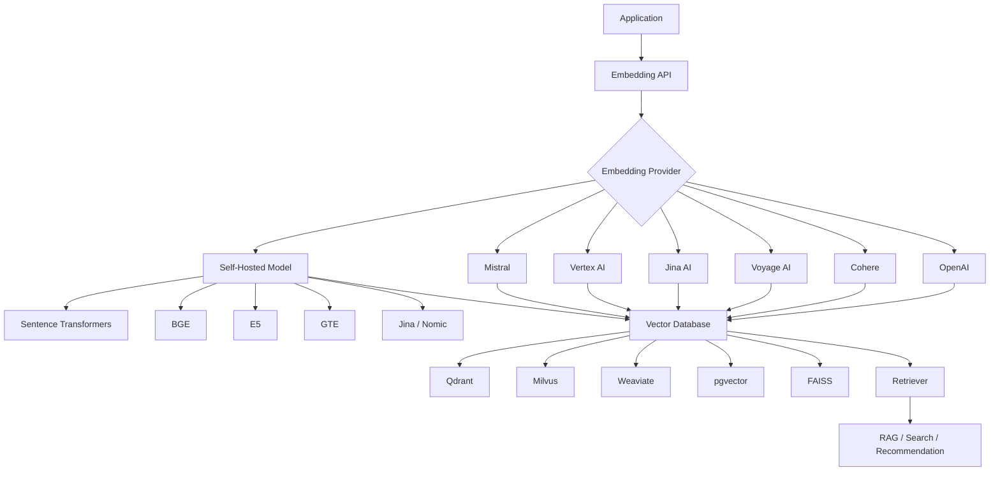
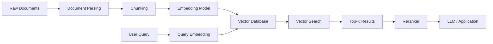

# Awesome-Embedding-Model-API

# 🧠 Top Embedding Model APIs


A curated list of **Embedding Model APIs**, hosted embedding platforms, text embedding services, multimodal embedding APIs, open-source embedding models, embedding inference servers, and vector-retrieval building blocks.


> **Open-source software is the primary focus of this repository.** The goal is to cover both commercial embedding APIs and the rapidly growing ecosystem of open-source embedding models that can be self-hosted, fine-tuned, and deployed without depending on a proprietary API.


Embedding models convert text, code, images, or other data into numerical vectors that capture semantic relationships. These vectors power applications such as:


* 🔎 Semantic Search

* 📚 Retrieval-Augmented Generation (RAG)

* 🧠 Knowledge Bases

* 🗂️ Document Clustering

* 🏷️ Classification

* 🔗 Recommendation Systems

* 💬 Semantic Similarity

* 🧑‍💻 Code Search

* 🖼️ Multimodal Search

* 🔍 Duplicate Detection

* 🤖 AI Agents

* 🏢 Enterprise Search


---


## 📑 Table of Contents


* [☁️ SaaS/Hosted Platforms](#️-saashosted-platforms)

* [🌍 Open-Source](#-open-source)

* [🧠 Open-Source Embedding Model Families](#-open-source-embedding-model-families)

* [⚡ Open-Source Embedding Inference & Serving](#-open-source-embedding-inference--serving)

* [🔬 Open-Source Embedding Frameworks](#-open-source-embedding-frameworks)

* [🌎 Multilingual Embedding Models](#-multilingual-embedding-models)

* [💻 Code Embedding Models](#-code-embedding-models)

* [🖼️ Multimodal Embedding Models](#️-multimodal-embedding-models)

* [🗄️ Open-Source Vector Databases](#️-open-source-vector-databases)

* [🏗️ Embedding Architecture](#️-embedding-architecture)

* [🔍 Commercial vs Open-Source](#-commercial-vs-open-source)

* [⭐ Recommended Open-Source Stacks](#-recommended-open-source-stacks)

* [🚧 Where Open Source Still Has Gaps](#-where-open-source-still-has-gaps)

* [🤝 How to Contribute](#-how-to-contribute)

* [⚠️ Disclaimer](#️-disclaimer)


---


# ☁️ SaaS/Hosted Platforms


Commercial and hosted APIs providing managed embedding models for semantic search, RAG, recommendations, classification, clustering, code search and multimodal retrieval.


| Platform                                                                                                            | Description                                                                                                                         | Primary Focus                  |

| ------------------------------------------------------------------------------------------------------------------- | ----------------------------------------------------------------------------------------------------------------------------------- | ------------------------------ |

| [OpenAI Embeddings](https://platform.openai.com/docs/guides/embeddings)                                             | Managed embedding APIs for generating vector representations for search, clustering, recommendations and related tasks.             | General Embeddings             |

| [Cohere Embed](https://cohere.com/embed)                                                                            | Enterprise embedding API supporting text and multimodal inputs, with embeddings designed for search, classification and clustering. | Enterprise Search / Multimodal |

| [Voyage AI](https://www.voyageai.com/)                                                                              | Specialized embedding platform offering general-purpose, multilingual, code, finance and domain-oriented embedding models.          | Retrieval / Domain Embeddings  |

| [Jina AI Embeddings](https://jina.ai/embeddings/)                                                                   | Embedding APIs focused on long-context, multilingual and multimodal retrieval workloads.                                            | Search / RAG                   |

| [Nomic Embed](https://www.nomic.ai/)                                                                                | Embedding ecosystem providing high-quality open-weight embeddings and hosted embedding capabilities.                                | Open Models / Retrieval        |

| [Google Vertex AI Embeddings](https://cloud.google.com/vertex-ai/generative-ai/docs/embeddings/get-text-embeddings) | Managed Google Cloud embedding models for semantic search, classification, clustering and retrieval applications.                   | Cloud AI                       |

| [Mistral Embeddings](https://docs.mistral.ai/capabilities/embeddings/)                                              | Embedding API supporting text and code embeddings for retrieval, classification, clustering and semantic search.                    | Text / Code                    |

| [Amazon Titan Text Embeddings](https://aws.amazon.com/bedrock/amazon-models/)                                       | Amazon Bedrock embedding models for semantic search, RAG and other vector-based applications.                                       | AWS / Enterprise               |

| [Azure OpenAI Embeddings](https://azure.microsoft.com/en-us/products/ai-services/openai-service)                    | Azure-hosted OpenAI embedding models integrated with Microsoft's enterprise cloud and security ecosystem.                           | Enterprise Cloud               |

| [Infinity Embeddings](https://github.com/michaelfeil/infinity)                                                      | High-performance embedding inference platform that can expose embedding and reranking models through APIs.                          | Self-Hosted / API              |

| [Voyage AI](https://docs.voyageai.com/)                                                                             | API platform offering high-performance retrieval embeddings with configurable dimensions and domain-specific models.                | Retrieval                      |

| [IBM watsonx Embeddings](https://www.ibm.com/watsonx)                                                               | Enterprise AI platform providing embedding capabilities as part of the watsonx ecosystem.                                           | Enterprise AI                  |

| [NVIDIA NIM](https://www.nvidia.com/en-us/ai-data-science/products/nim-microservices/)                              | Containerized inference services for deploying optimized AI models, including embedding workloads.                                  | GPU Inference                  |

| [Hugging Face Inference Providers](https://huggingface.co/inference)                                                | Hosted access to models from the Hugging Face ecosystem through inference APIs.                                                     | Open Models                    |

| [Replicate](https://replicate.com/)                                                                                 | Hosted API platform for running machine-learning models, including embedding and retrieval models.                                  | Model APIs                     |

| [Together AI](https://www.together.ai/)                                                                             | Hosted inference platform supporting a broad ecosystem of open models and embedding workloads.                                      | Open Models                    |

| [Fireworks AI](https://fireworks.ai/)                                                                               | Production AI inference platform supporting open models and high-performance AI APIs.                                               | Inference                      |

| [Cloudflare Workers AI](https://developers.cloudflare.com/workers-ai/)                                              | Edge AI platform providing hosted model inference close to applications and users.                                                  | Edge AI                        |

| [Jina AI](https://jina.ai/)                                                                                         | AI infrastructure platform providing embeddings, reranking and search-oriented APIs.                                                | Search Infrastructure          |

| [Voyage AI](https://www.voyageai.com/)                                                                              | Specialized retrieval model provider with general, multilingual and domain-specific embedding models.                               | Retrieval                      |


> Cohere's current Embed API supports text and image inputs, and its API distinguishes use cases such as `search_document`, `search_query`, classification and clustering.


> Voyage provides hosted embedding models for general, multilingual and specialized retrieval workloads, with configurable embedding dimensions on supported models.


> Mistral provides both general text embeddings and code embeddings, covering use cases such as RAG, semantic code search, clustering and classification.


---


# 🌍 Open-Source


Open-source embedding models, frameworks and infrastructure that can be self-hosted and integrated into applications without requiring a proprietary embedding API.


> Open-source embedding software can be used with local GPUs, CPUs, Kubernetes clusters, private clouds or ordinary application servers.


| Project                                                                  | Description                                                                                                              | Best Use                    |

| ------------------------------------------------------------------------ | ------------------------------------------------------------------------------------------------------------------------ | --------------------------- |

| [Sentence Transformers](https://github.com/UKPLab/sentence-transformers) | Open-source framework for generating, training and fine-tuning sentence, text and image embeddings as well as rerankers. | General Embeddings          |

| [FlagEmbedding / BGE](https://github.com/FlagOpen/FlagEmbedding)         | Open-source retrieval toolkit containing BGE embedding, reranking, multimodal and fine-tuning models.                    | RAG / Retrieval             |

| [E5](https://github.com/microsoft/unilm/tree/master/e5)                  | Microsoft's family of general-purpose text embedding models for retrieval and semantic similarity.                       | Retrieval                   |

| [GTE](https://huggingface.co/Alibaba-NLP)                                | Alibaba-NLP embedding model family covering general-purpose and multilingual retrieval.                                  | Retrieval                   |

| [Jina Embeddings](https://huggingface.co/jinaai)                         | Jina's openly available embedding model ecosystem for text and multimodal retrieval.                                     | Long Context / Retrieval    |

| [Nomic Embed](https://huggingface.co/nomic-ai)                           | Open embedding models from Nomic designed for semantic search and retrieval.                                             | General Retrieval           |

| [GritLM](https://github.com/ContextualAI/gritlm)                         | Open model architecture supporting both generation and embedding-oriented retrieval workloads.                           | Retrieval / Generation      |

| [ColBERT](https://github.com/stanford-futuredata/ColBERT)                | Late-interaction retrieval architecture using token-level embeddings.                                                    | High-Quality Search         |

| [Instructor](https://github.com/HKUNLP/Instructor)                       | Instruction-finetuned embedding models for task-specific semantic representations.                                       | Instruction-Aware Retrieval |

| [LaBSE](https://github.com/UKPLab/sentence-transformers)                 | Multilingual sentence embedding model supporting cross-language semantic similarity.                                     | Multilingual                |

| [Universal Sentence Encoder](https://github.com/tensorflow/hub)          | Sentence embedding ecosystem from Google Research.                                                                       | Semantic Similarity         |

| [SimCSE](https://github.com/princeton-nlp/SimCSE)                        | Contrastive learning approach for sentence embeddings.                                                                   | Semantic Similarity         |

| [GISTEmbed](https://github.com/xlang-ai/GISTEmbed)                       | Embedding models optimized using guided in-context similarity signals.                                                   | Retrieval                   |

| [BGE-M3](https://github.com/FlagOpen/FlagEmbedding)                      | Multilingual embedding model supporting dense, sparse and multi-vector retrieval.                                        | Multilingual RAG            |

| [Voyage Open Models](https://huggingface.co/voyageai)                    | Open-weight Voyage embedding models available for self-hosted experimentation and deployment.                            | Open Retrieval              |


Sentence Transformers supports computing embeddings, training and fine-tuning embedding models, sparse encoders, rerankers and multi-vector encoders; its ecosystem includes thousands of pretrained models.


FlagEmbedding provides a broader retrieval toolkit covering embedding inference, reranking, fine-tuning and evaluation, including the BGE family.


---


# 🧠 Open-Source Embedding Model Families


## BGE


**BGE — BAAI General Embedding**


```text

BGE

├── BGE-Base

├── BGE-Large

├── BGE-M3

├── BGE-ICL

├── BGE-VL

└── BGE Rerankers

```


Best suited for:


* Semantic search

* RAG

* Multilingual retrieval

* Dense retrieval

* Sparse retrieval

* Multi-vector retrieval

* Multimodal search


BGE-M3 is particularly interesting because it supports dense retrieval, lexical matching and multi-vector interaction.


---


## E5


```text

E5

├── E5-base

├── E5-large

├── multilingual-e5

└── E5-Mistral

```


Best suited for:


* Semantic search

* Cross-lingual retrieval

* RAG

* Sentence similarity


---


## GTE


```text

GTE

├── GTE-base

├── GTE-large

├── GTE-modernbert

└── multilingual GTE

```


Best suited for:


* General semantic retrieval

* Multilingual applications

* RAG

* Search


---


## Nomic Embed


```text

Nomic Embed

├── nomic-embed-text

└── newer Nomic embedding models

```


Best suited for:


* Long-context retrieval

* Semantic search

* RAG

* Local inference


---


## Jina Embeddings


```text

Jina Embeddings

├── Jina Embeddings v2

├── Jina Embeddings v3

├── Jina Embeddings v4

└── Multilingual / Multimodal Models

```


Best suited for:


* Long documents

* Multilingual search

* RAG

* Multimodal retrieval


---


# ⚡ Open-Source Embedding Inference & Serving


These projects turn open embedding models into production APIs.


| Project                                                                                            | Description                                                                                                              | Best Use              |

| -------------------------------------------------------------------------------------------------- | ------------------------------------------------------------------------------------------------------------------------ | --------------------- |

| [Infinity](https://github.com/michaelfeil/infinity)                                                | High-performance inference server for embedding and reranking models with API-compatible serving.                        | Production Embeddings |

| [Hugging Face Text Embeddings Inference](https://github.com/huggingface/text-embeddings-inference) | Specialized inference server for text embedding models.                                                                  | Embedding API         |

| [vLLM](https://github.com/vllm-project/vllm)                                                       | High-performance inference engine that supports modern embedding and pooling workloads in addition to generative models. | High-Throughput AI    |

| [Sentence Transformers](https://github.com/UKPLab/sentence-transformers)                           | Python framework for directly generating embeddings from pretrained models.                                              | Development / Serving |

| [FlagEmbedding](https://github.com/FlagOpen/FlagEmbedding)                                         | Toolkit for embedding and reranker inference, training and evaluation.                                                   | Retrieval Models      |

| [TEI](https://github.com/huggingface/text-embeddings-inference)                                    | Hugging Face's optimized server for text embeddings and related models.                                                  | Production Serving    |

| [Ollama](https://github.com/ollama/ollama)                                                         | Local model runtime that can be used with supported embedding models.                                                    | Local AI              |

| [llama.cpp](https://github.com/ggml-org/llama.cpp)                                                 | Lightweight inference ecosystem that can support embedding workloads for compatible models.                              | CPU / Edge            |

| [NVIDIA Triton](https://github.com/triton-inference-server/server)                                 | General-purpose production inference server suitable for embedding model deployment.                                     | Enterprise GPU        |

| [KServe](https://github.com/kserve/kserve)                                                         | Kubernetes-native model-serving infrastructure.                                                                          | Cloud / Kubernetes    |

| [Ray Serve](https://github.com/ray-project/ray)                                                    | Distributed serving framework suitable for large-scale embedding services.                                               | Distributed Serving   |


---


# 🔬 Open-Source Embedding Frameworks


| Framework                                                                | Description                                                                        | Primary Use           |

| ------------------------------------------------------------------------ | ---------------------------------------------------------------------------------- | --------------------- |

| [Sentence Transformers](https://github.com/UKPLab/sentence-transformers) | Complete ecosystem for embedding generation, training and evaluation.              | Embedding Development |

| [FlagEmbedding](https://github.com/FlagOpen/FlagEmbedding)               | Retrieval-focused embedding and reranking toolkit.                                 | RAG                   |

| [LlamaIndex](https://github.com/run-llama/llama_index)                   | Data framework that integrates embedding models into RAG and agent pipelines.      | RAG                   |

| [Haystack](https://github.com/deepset-ai/haystack)                       | Modular AI framework supporting embedding-based retrieval pipelines.               | Enterprise Search     |

| [LangChain](https://github.com/langchain-ai/langchain)                   | Application framework with broad embedding-model integrations.                     | AI Applications       |

| [txtai](https://github.com/neuml/txtai)                                  | Semantic search and embeddings-based workflow engine.                              | Semantic Search       |

| [DSPy](https://github.com/stanfordnlp/dspy)                              | Framework for optimizing language-model pipelines, including retrieval systems.    | AI Optimization       |

| [Haystack](https://github.com/deepset-ai/haystack)                       | Production-oriented framework for retrieval, document processing and AI pipelines. | RAG                   |

| [ColBERT](https://github.com/stanford-futuredata/ColBERT)                | Neural retrieval architecture based on token-level representations.                | Advanced Retrieval    |


---


# 🌎 Multilingual Embedding Models


Multilingual embeddings allow queries and documents in different languages to occupy compatible vector spaces.


| Model / Project                                                          | Primary Strength                                   |

| ------------------------------------------------------------------------ | -------------------------------------------------- |

| [BGE-M3](https://huggingface.co/BAAI/bge-m3)                             | Multilingual + dense/sparse/multi-vector retrieval |

| [multilingual-e5](https://huggingface.co/intfloat/multilingual-e5-large) | Cross-language semantic retrieval                  |

| [LaBSE](https://huggingface.co/sentence-transformers/LaBSE)              | Multilingual sentence similarity                   |

| [Jina Embeddings](https://huggingface.co/jinaai)                         | Multilingual retrieval                             |

| [GTE](https://huggingface.co/Alibaba-NLP)                                | Multilingual semantic search                       |

| [Cohere Embed](https://cohere.com/embed)                                 | Hosted multilingual enterprise embeddings          |

| [Voyage AI](https://www.voyageai.com/)                                   | Hosted multilingual retrieval embeddings           |

| [OpenAI Embeddings](https://platform.openai.com/docs/guides/embeddings)  | General multilingual semantic representations      |


---


# 💻 Code Embedding Models


Code embeddings are useful for:


* Code search

* Repository search

* Developer assistants

* Code RAG

* Duplicate-code detection

* Vulnerability analysis

* Documentation retrieval


| Project                                                                     | Description                                                                                   |

| --------------------------------------------------------------------------- | --------------------------------------------------------------------------------------------- |

| [CodeBERT](https://github.com/microsoft/CodeBERT)                           | Transformer-based model family for programming-language and natural-language representations. |

| [GraphCodeBERT](https://github.com/microsoft/CodeBERT)                      | Code representation model incorporating structural information.                               |

| [UniXcoder](https://github.com/microsoft/CodeBERT)                          | Unified model for code understanding and generation.                                          |

| [Jina Code Embeddings](https://huggingface.co/jinaai)                       | Embedding models designed for code retrieval and related developer workloads.                 |

| [Voyage Code](https://www.voyageai.com/)                                    | Hosted code retrieval embedding models.                                                       |

| [Mistral Code Embeddings](https://docs.mistral.ai/capabilities/embeddings/) | Managed code embedding API for code retrieval and analytics.                                  |


---


# 🖼️ Multimodal Embedding Models


Modern embedding systems increasingly support multiple modalities.


```text

              Multimodal Embedding

                     │

        ┌────────────┼────────────┐

        ↓            ↓            ↓

       Text         Image        Code

        │            │            │

        └────────────┼────────────┘

                     ↓

              Shared Vector Space

                     │

       ┌─────────────┼─────────────┐

       ↓             ↓             ↓

    Search        Retrieval     Recommendations

```


| Project / Model                                            | Modalities                  | Primary Use               |

| ---------------------------------------------------------- | --------------------------- | ------------------------- |

| [BGE-VL](https://github.com/FlagOpen/FlagEmbedding)        | Text + Image                | Multimodal Retrieval      |

| [Cohere Embed](https://cohere.com/embed)                   | Text + Image                | Multimodal Search         |

| [CLIP](https://github.com/openai/CLIP)                     | Text + Image                | Image-Text Search         |

| [SigLIP](https://github.com/google-research/big_vision)    | Text + Image                | Multimodal Retrieval      |

| [Jina Embeddings](https://huggingface.co/jinaai)           | Text + Image                | Multimodal Search         |

| [Nomic Embed](https://huggingface.co/nomic-ai)             | Text + Multimodal Ecosystem | Retrieval                 |

| [ImageBind](https://github.com/facebookresearch/ImageBind) | Multiple Modalities         | Multimodal Representation |


---


# 🗄️ Open-Source Vector Databases


Embeddings are normally stored in a vector database or another vector-search system.


| Project                                                        | Description                                                           | Best Use                    |

| -------------------------------------------------------------- | --------------------------------------------------------------------- | --------------------------- |

| [Qdrant](https://github.com/qdrant/qdrant)                     | High-performance open-source vector database.                         | Production RAG              |

| [Milvus](https://github.com/milvus-io/milvus)                  | Distributed vector database designed for large-scale AI applications. | Large-Scale Retrieval       |

| [Weaviate](https://github.com/weaviate/weaviate)               | Open-source vector database with semantic search capabilities.        | AI Applications             |

| [Chroma](https://github.com/chroma-core/chroma)                | Developer-friendly open-source embedding database.                    | RAG Development             |

| [pgvector](https://github.com/pgvector/pgvector)               | PostgreSQL extension for vector similarity search.                    | Existing PostgreSQL Systems |

| [FAISS](https://github.com/facebookresearch/faiss)             | Efficient vector similarity-search library.                           | Local / Research            |

| [Vespa](https://github.com/vespa-engine/vespa)                 | Search and serving platform supporting vector search and ranking.     | Large-Scale Search          |

| [OpenSearch](https://github.com/opensearch-project/OpenSearch) | Search engine with vector and semantic-search capabilities.           | Enterprise Search           |

| [Elasticsearch](https://github.com/elastic/elasticsearch)      | Search platform supporting vector and semantic retrieval.             | Enterprise Search           |

| [LanceDB](https://github.com/lancedb/lancedb)                  | Embedded/serverless vector database built around Lance.               | AI Data                     |

| [Vald](https://github.com/vdaas/vald)                          | Kubernetes-native distributed vector search engine.                   | Kubernetes AI               |


---


# 🏗️ Embedding Architecture


A typical production embedding system looks like:





---


# 🔄 Embedding Pipeline





---


# 🧮 Dense vs Sparse vs Multi-Vector Embeddings


Modern retrieval systems are no longer limited to one vector per document.


| Retrieval Type | Description                                                      | Examples        |

| -------------- | ---------------------------------------------------------------- | --------------- |

| Dense          | A continuous vector representation of semantic meaning.          | BGE, E5, OpenAI |

| Sparse         | Sparse representations emphasizing individual terms/tokens.      | SPLADE, BM25    |

| Multi-Vector   | Multiple vectors represent different parts/tokens of a document. | ColBERT         |

| Hybrid         | Combines lexical and semantic retrieval.                         | BM25 + BGE      |

| Multimodal     | Shared representations across modalities.                        | CLIP, BGE-VL    |


BGE-M3 is notable because its toolkit supports dense retrieval, lexical matching and multi-vector interaction.


---


# 🔍 Commercial vs Open-Source


| Capability                    |      SaaS/Hosted APIs |             Open-Source |

| ----------------------------- | --------------------: | ----------------------: |

| Hosted embedding API          |                     ✅ |            ⚠️ Self-host |

| Text embeddings               |                     ✅ |                       ✅ |

| Multilingual embeddings       |                     ✅ |                       ✅ |

| Code embeddings               |                     ✅ |                       ✅ |

| Multimodal embeddings         |                     ✅ |                       ✅ |

| Custom models                 | ⚠️ Provider dependent |                       ✅ |

| Fine-tuning                   | ⚠️ Provider dependent |                       ✅ |

| Model weights                 | ❌ Usually unavailable |       ✅ For many models |

| Private deployment            | ⚠️ Provider dependent |                       ✅ |

| Data sovereignty              | ⚠️ Provider dependent |                       ✅ |

| Offline inference             |                     ❌ |                       ✅ |

| GPU optimization              |      Provider managed |          ✅ Full control |

| Cost per request              |        💰 Usage based | 💰 Infrastructure based |

| Vendor lock-in                |             ⚠️ Higher |                 ✅ Lower |

| Operational complexity        |                 ✅ Low |                ❌ Higher |

| Model switching               |      ⚠️ API dependent |                  ✅ High |

| Custom dimensions             |    ⚠️ Model dependent |       ✅ Model dependent |

| Custom retrieval architecture |            ⚠️ Limited |          ✅ Full control |


---


# ⭐ Recommended Open-Source Stacks


## 🥇 1. Simple Local Embeddings


```text

Sentence Transformers

        +

BGE / E5 / GTE

        +

FAISS

```


**Best for:**


* Prototypes

* Local applications

* Research

* Small RAG systems

* Offline applications


---


## 🥈 2. Production RAG


```text

BGE / E5 / GTE

        +

Infinity / TEI

        +

Qdrant

        +

Reranker

```


**Best for:**


* Production semantic search

* Enterprise RAG

* High-throughput embedding APIs


---


## 🥉 3. Enterprise-Scale Retrieval


```text

Kubernetes

     +

Embedding Serving

     +

BGE-M3 / E5 / GTE

     +

Qdrant / Milvus / Weaviate

     +

Reranker

     +

LLM

```


**Best for:**


* Large document collections

* Enterprise search

* Multi-tenant SaaS

* High-volume RAG


---


## ⚡ 4. Hybrid Retrieval


```text

                 Query

                   │

          ┌────────┴────────┐

          ↓                 ↓

       BM25             Dense Vector

          │                 │

          └────────┬────────┘

                   ↓

             Hybrid Search

                   ↓

                Reranker

                   ↓

               Top Results

```


**Best for:**


* Enterprise search

* Technical documentation

* Code search

* Exact terminology

* Long-tail queries


---


# 💡 Building Your Own Embedding API


A completely self-hosted embedding API can be surprisingly compact:


```text

                    REST API

                       │

                       ↓

                 API Gateway

                       │

                       ↓

              Embedding Server

                       │

             ┌─────────┴─────────┐

             ↓                   ↓

        BGE / E5 / GTE       Custom Model

             │                   │

             └─────────┬─────────┘

                       ↓

                 Vector Database

                       │

             ┌─────────┼─────────┐

             ↓         ↓         ↓

          Qdrant     Milvus    pgvector

```


Possible implementation:


```text

FastAPI

   +

Infinity / TEI

   +

BGE-M3

   +

Qdrant

```


This provides the basic foundation of a private **OpenAI-compatible embedding service** without requiring a commercial embedding API.


---


# 🧠 Embedding API Selection Guide


| Requirement                 | Recommended Option                         |

| --------------------------- | ------------------------------------------ |

| Easiest managed API         | OpenAI                                     |

| Enterprise search           | Cohere                                     |

| High-end retrieval quality  | Voyage AI                                  |

| Long-context retrieval      | Jina AI                                    |

| Open-weight ecosystem       | Nomic / Hugging Face                       |

| Google Cloud ecosystem      | Vertex AI                                  |

| AWS ecosystem               | Amazon Titan                               |

| Microsoft ecosystem         | Azure OpenAI                               |

| Code retrieval              | Voyage / Jina / Mistral                    |

| Self-hosting                | BGE / E5 / GTE                             |

| Simple Python deployment    | Sentence Transformers                      |

| High-performance serving    | Infinity / TEI / vLLM                      |

| Large-scale vector search   | Milvus / Qdrant                            |

| PostgreSQL ecosystem        | pgvector                                   |

| Local experimentation       | Sentence Transformers + FAISS              |

| Multilingual RAG            | BGE-M3 / multilingual-E5                   |

| Multimodal retrieval        | BGE-VL / CLIP / SigLIP                     |

| Maximum vendor independence | Open-source models + self-hosted inference |


---


# 🚧 Where Open Source Still Has Gaps


### 1. Managed Reliability


Commercial APIs provide managed:


* scaling

* availability

* monitoring

* authentication

* rate limiting

* infrastructure


Self-hosted deployments must implement these themselves.


### 2. Benchmarking


Embedding quality is highly dependent on:


* language

* domain

* chunk size

* query type

* retrieval strategy

* reranking

* vector database configuration


A model that performs extremely well on one benchmark may not be the best model for a particular production workload.


### 3. GPU Economics


For very large workloads, operating GPU infrastructure can require substantial engineering and capital.


### 4. Multimodal Embeddings


Text embeddings are mature, but multimodal retrieval remains a rapidly evolving area.


### 5. Enterprise Governance


Commercial APIs often provide integrated:


* IAM

* audit logging

* compliance

* organization management

* usage controls


These typically need to be assembled from multiple components in an open-source architecture.


---


# 🗺️ Embedding Model Landscape


```mermaid

mindmap


  root((Embedding Models))


    Commercial APIs


      OpenAI

      Cohere

      Voyage AI

      Jina AI

      Google Vertex AI

      Mistral

      Amazon Titan

      Azure OpenAI


    Open Source


      BGE

      E5

      GTE

      Nomic

      Jina

      Instructor

      GIST

      SimCSE


    Serving


      Infinity

      TEI

      vLLM

      Triton

      KServe


    Retrieval


      Dense

      Sparse

      Multi-Vector

      Hybrid

      Multimodal


    Vector Databases


      Qdrant

      Milvus

      Weaviate

      Chroma

      pgvector

      FAISS

      Vespa

```


---


# 🤝 How to Contribute


Contributions are welcome!


Please consider adding:


* Open-source embedding models

* Embedding inference servers

* Multilingual models

* Code embedding models

* Multimodal embedding models

* Sparse embedding models

* Multi-vector retrieval systems

* Embedding evaluation frameworks

* Vector databases

* Reranking systems

* Hosted embedding APIs

* Embedding optimization tools


When adding an open-source project, please prefer:


1. Active development

2. Clear licensing

3. Production relevance

4. Good documentation

5. Meaningful community adoption

6. Genuine relevance to embeddings or vector retrieval


Please avoid placing proprietary models or hosted-only products in the **Open-Source** section.


---


# ⚠️ Disclaimer


This repository is a community-maintained directory intended for educational, research and engineering purposes.


The inclusion of a company, API, model, framework or open-source project does not constitute an endorsement.


Embedding model capabilities, pricing, licensing, model availability and API specifications can change over time. Always verify the current official documentation and license before using a model or service in production.


**Open-source does not necessarily mean free of infrastructure, compute or operational costs.**


---


## ⭐ Star History


If you find this repository useful, consider giving it a ⭐ star.


It helps others discover the project and encourages continued curation.


---


**Last updated: August 2026**
